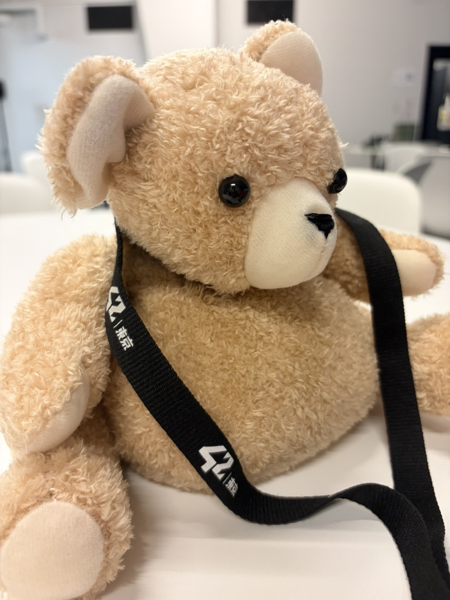

全国学生対抗SFハッカソン「Electric Sheep 2026」に、Team 07「ft_friends」として出場しました。

約2か月かけて制作した「えふてぃ」で、**優勝**と**ForA OneTeam賞**を受賞しました。

## Electric Sheep 2026とは

Electric Sheep 2026は、メ〜テレが主催する学生向けハッカソンです。SF小説家と一緒に未来社会の課題を考え、AIやテクノロジーを使って解決策を形にします。

今回のテーマは、**「100歳のわたしの幸せ」**。200人のエントリーから選ばれた10チーム・50人が、2026年7月4日のキックオフから開発を進めました。

7月末と8月末のオンラインレビューを経て、9月12日・13日に名古屋の東別院ホールで本戦が行われました。

## 作ったもの

私たちが作ったのは、日々の出来事を記録し、未来の自分がぬいぐるみとの会話を通して思い出を振り返れるプロダクト「えふてぃ」です。

スマートフォンの中で写真や文章を探すのではなく、身近なぬいぐるみに話しかける。その自然なやり取りから、昔の友達や出来事を思い出せる体験を目指しました。

## どうやって記憶を残すのか

えふてぃは、4つの要素でできています。

1. **Efty Recorder**が、身に着けた状態で音声と写真を記録する
2. **iPhoneアプリ**が、記録中の位置情報とGoogleカレンダーの予定を集める
3. **FirebaseとAI**が、それらの情報を一つの出来事として整理する
4. **Efty Bear**が、過去の記憶を参照しながら会話し、関連する写真をiPhoneに表示する

記録デバイスとiPhoneはBLEで状態と時刻を共有し、記録したデータはWi-Fi経由でFirebaseへ送ります。クラウド側では音声・写真・位置・予定を組み合わせ、会話から検索できる記憶へ変換します。

詳しい構成や技術スタックは、[Worksの「えふてぃ」ページ](/works/efty-electric-sheep-2026)にまとめています。

## 評価されたこと

審査は僅差で、プレゼンテーションだけでは大きな差がつかなかったそうです。その中で、質疑応答を通して実装と体験の作り込みが伝わったことが、評価につながりました。

特に評価されたのは、次のような点です。

- 録音済みの音声と間違えるほど自然だった、生成システムによる会話
- センサーや近接体験まで含め、細部を実際に動く形へ落とし込んだこと
- ぬいぐるみの見た目と、内部の音声生成の仕組みの両方にこだわったこと
- 身近な友達との記憶を、ぬいぐるみという形で未来へ持っていく体験

一方で、プレゼンテーションは「優等生すぎる」という改善コメントもあり、もっと尖った表現にしてもよかったというフィードバックを受けました。

## 結果

- **Electric Sheep 2026 優勝**
- **ForA OneTeam賞 受賞**

アイデアだけでなく、ハードウェア・iPhoneアプリ・クラウド・AI・ぬいぐるみをつなぎ、一つの体験として形にした点が評価されました。

[Electric Sheep 2026 公式サイト](https://www.nagoyatv.com/hackathon-electricsheep/)
